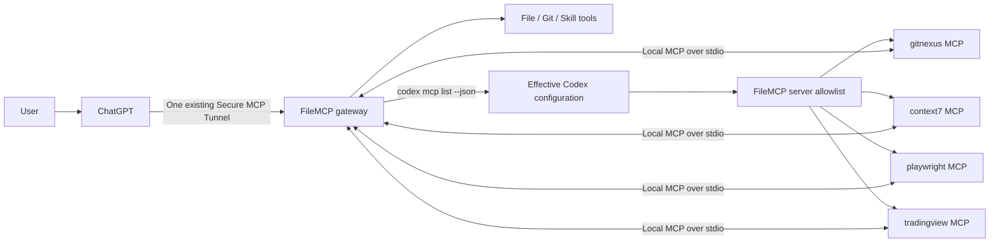
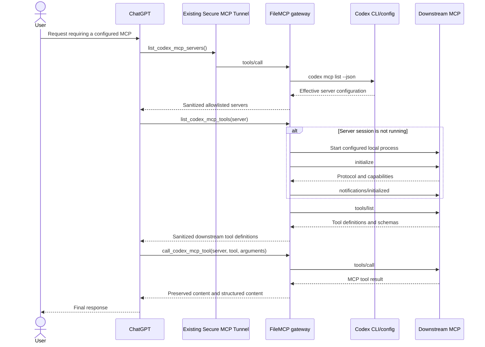

# Codex MCP federation plan

> Implementation status: the Phase 1 stdio gateway, explicit enablement,
> allowlist, persistent downstream sessions, and disconnect cleanup are wired
> into both native implementations. Streamable HTTP remains Phase 2 work.

## Goal

Allow a ChatGPT custom app connected through FileMCP to discover and call MCP
servers that are enabled in the local Codex configuration. FileMCP remains the
single public MCP endpoint; downstream Codex MCP servers remain local and are
never exposed directly through the tunnel.

## Current state

FileMCP currently exposes filesystem, Git, optional shell, and two read-only
Codex skill tools. `CodexSkillRegistry` reads project skills from
`<shared-directory>/.agents/skills`, but there is no downstream MCP client or
MCP transport bridge.

## Architecture and call flow

ChatGPT connects only to FileMCP through the existing Secure MCP Tunnel.
Downstream Codex MCP servers stay local and do not need their own tunnels or
ChatGPT app registrations.



FileMCP is both the MCP server seen by ChatGPT and an MCP client of each
allowlisted downstream server. Discovery and invocation use the following
sequence:



For example, the top-level call received by FileMCP can be:

```json
{
  "name": "call_codex_mcp_tool",
  "arguments": {
    "server": "context7",
    "tool": "query-docs",
    "arguments": {
      "libraryId": "/tanstack/query",
      "query": "React Query invalidation"
    }
  }
}
```

FileMCP converts only the inner operation into the downstream MCP request:

```json
{
  "jsonrpc": "2.0",
  "id": 42,
  "method": "tools/call",
  "params": {
    "name": "query-docs",
    "arguments": {
      "libraryId": "/tanstack/query",
      "query": "React Query invalidation"
    }
  }
}
```

Commands, environment variables, headers, and credentials from the Codex
configuration are never returned to ChatGPT. Only sanitized server status,
downstream tool definitions, and downstream tool results cross the existing
FileMCP tunnel.

On 2026-10-07, `codex mcp list --json` reported four enabled `stdio` servers in
the development environment. A read-only protocol probe performed
`initialize`, `notifications/initialized`, and `tools/list` against each one:

| Server | Transport | Result | Tool count |
| --- | --- | --- | ---: |
| `gitnexus` | stdio | passed | 13 |
| `context7` | stdio via `npx` | passed | 2 |
| `playwright` | stdio via `npx` | passed | 25 |
| `tradingview` | stdio via `node` | passed | 78 |

The two `npx` servers did not start inside the restricted test sandbox and did
start when package-cache/network access was allowed. Federation must therefore
isolate startup failures and honor Codex's per-server startup timeout.

## Recommended interface

Expose three FileMCP tools only when **Codex MCP federation** is explicitly
enabled in Settings:

1. `list_codex_mcp_servers()` returns server name, enabled/available state,
   transport, and a sanitized error. It never returns commands, arguments,
   environment values, headers, or tokens.
2. `list_codex_mcp_tools(server)` returns the downstream tool definitions for
   one allowlisted server after performing MCP initialization.
3. `call_codex_mcp_tool(server, tool, arguments)` forwards one `tools/call`
   request and returns the downstream MCP result without flattening or
   rewriting its content blocks.

Do not flatten all downstream tools into FileMCP's top-level `tools/list`.
There are already 118 tools in the test configuration; flattening increases
prompt size, creates name collisions, leaks server inventory unnecessarily,
and makes availability changes invalidate the entire top-level tool cache.

The FileMCP server instructions should tell the model to call
`list_codex_mcp_servers`, then `list_codex_mcp_tools`, before invoking a tool it
does not already know. The gateway tools should be annotated as open-world.
The call tool itself must not claim to be read-only or non-destructive because
the selected downstream tool determines those properties.

## Configuration and authorization

- Add an off-by-default `EnableCodexMcpFederation` setting on both platforms.
- Add a multi-select allowlist of Codex MCP server names. Enabling federation
  without selecting a server exposes nothing.
- Obtain the effective configuration with `codex mcp list --json`. This keeps
  FileMCP aligned with Codex's supported TOML schema and configuration layers
  instead of maintaining a second partial TOML parser.
- Resolve the `codex` executable once when settings are saved. Show an
  actionable error if it is missing or its JSON schema is unsupported.
- Do not warn merely because Codex is absent when federation is disabled.
  FileMCP's filesystem, Git, skill, command, and tunnel features do not require
  Codex and must continue to start normally.
- If federation is enabled and Codex cannot be resolved, show a persistent
  inline warning in Settings and write one sanitized `[Codex MCP]` warning per
  app session. Do not display a blocking startup dialog. Keep the FileMCP
  tunnel and local tools available, but omit all federation tools until the
  user installs/selects Codex and refreshes the configuration.
- When the user first enables federation, validate Codex immediately and offer
  two actions when it is missing: select the Codex executable or open the
  installation instructions. Store an explicitly selected executable path in
  FileMCP settings so GUI apps do not depend on an interactive shell's `PATH`.
- Treat JSON from the Codex CLI as sensitive. Never log transport commands,
  arguments, environment values, HTTP headers, bearer-token environment names,
  or downstream tool arguments/results.
- Refresh configuration on Connect and through an explicit Refresh action.
  Do not watch `~/.codex/config.toml`, because effective Codex configuration may
  include more than that one file.
- Existing **Allow shell commands** and the new federation permission should be
  independent. A user may safely want downstream MCP access without exposing
  FileMCP's arbitrary `run_command` tool.

## Runtime design

Introduce a platform-equivalent `CodexMcpGateway` owned by `LocalMcpServer`.

For `stdio` servers:

- Start the exact executable, arguments, working directory, and resolved
  environment returned by Codex.
- Keep one supervised process/session per server rather than spawning once per
  tool call. MCP servers commonly keep session state and can be expensive to
  start.
- Exchange newline-delimited JSON-RPC messages over stdin/stdout; read stderr
  separately with a strict size bound. Never interpret stderr as protocol data.
- Send `initialize`, verify the negotiated protocol, then send
  `notifications/initialized` before allowing `tools/list` or `tools/call`.
- Correlate responses by generated request ID; support concurrent calls without
  assuming response order.
- Enforce bounded message size, startup timeout, tool timeout, maximum
  concurrency, and process-tree cleanup. A malformed or exited server becomes
  unavailable without stopping FileMCP or other downstream servers.
- Handle downstream `notifications/tools/list_changed` by invalidating only
  that server's cached tool list.

For streamable HTTP servers:

- Implement after the stdio path, using the URL and resolved header/token
  configuration returned by Codex.
- Restrict redirects and validate the destination on every redirect to prevent
  credential forwarding to another origin.
- Preserve MCP session headers and protocol-version headers, and support the
  response content types Codex supports.

At shutdown, disconnect all downstream sessions and terminate their complete
process trees. Restart a failed session lazily on the next list/call request,
with backoff to prevent crash loops.

## Security decisions

- Server allowlisting is mandatory. A Codex MCP entry is executable code and
  may access resources outside FileMCP's shared directory.
- The UI must state that downstream tools use the OS permissions and credentials
  of the signed-in user and are not constrained by FileMCP's workspace path.
- Forward only a downstream tool name returned by that server's most recent
  `tools/list`; reject arbitrary JSON-RPC methods and server-name traversal.
- Cap downstream request and response payloads and return a truncation marker.
- Apply downstream tool annotations when displaying tools, but do not trust
  annotations as an enforcement boundary.
- Never expose Codex configuration content as an MCP tool result.
- Require confirmation through the ChatGPT host for destructive downstream
  tools when the host honors MCP annotations; FileMCP should preserve the
  original annotations and not weaken them.

## Delivery sequence

### Phase 1: stdio MVP

- Settings, allowlist UI, and persistence on macOS and Windows.
- Codex CLI JSON discovery and sanitized status reporting.
- Persistent stdio session, three gateway tools, lifecycle cleanup, and logs.
- Equivalent Swift and .NET tests with a deterministic fake MCP child process.

### Phase 2: HTTP parity

- Streamable HTTP transport, authentication resolution, sessions, redirects,
  and equivalent integration tests.

### Phase 3: UX and resilience

- Refresh/status UI, exponential restart backoff, tool-list change notification,
  metrics that contain no tool arguments/results, and compatibility fixtures
  for multiple Codex versions.

## Required tests

Unit and integration coverage should include:

- disabled-by-default behavior and empty allowlist;
- parsing supported `codex mcp list --json` fixtures and rejecting unknown
  schemas without logging secrets;
- stdio initialize/list/call success, interleaved response IDs, notifications,
  malformed JSON, oversized output, stderr flooding, startup timeout, tool
  timeout, early exit, restart backoff, and descendant-process cleanup;
- exact server/tool allowlist enforcement and rejection of arbitrary methods;
- preservation of content blocks, structured content, `isError`, and tool
  annotations;
- one failed server not affecting local FileMCP tools or another server;
- HTTP redirect credential isolation and MCP session-header behavior in Phase 2;
- modern and legacy FileMCP protocol surfaces returning the same gateway result;
- release-build smoke tests on macOS, Windows x64, and Windows ARM64.

The read-only development probe establishes that the configured stdio servers
are compatible with the proposed client handshake. It is not a substitute for
the deterministic fake-server tests above and intentionally did not invoke any
downstream tool.
